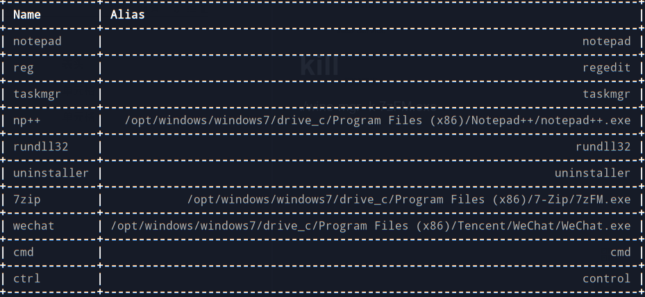
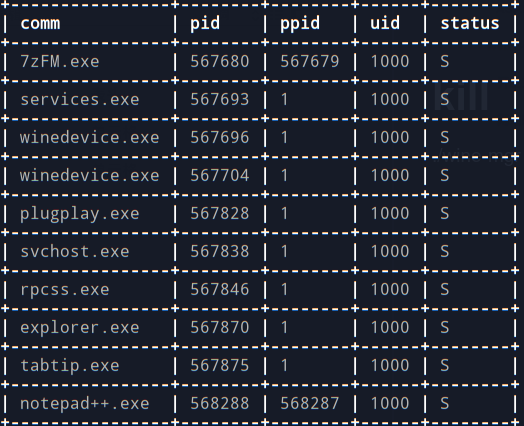

# Wine Eenvironment Manager
- show process alias
```shell
./wine-mgr -a
```

- start wine program
```shell
./wine-mgr -p 7zip -b
./wine-mgr -p reg
```

- show running process
```shell
./wine-mgr -l
```

- kill wine process
```shell
./wine-mgr -k 7zFM.exe
./wine-mgr -k all
```


